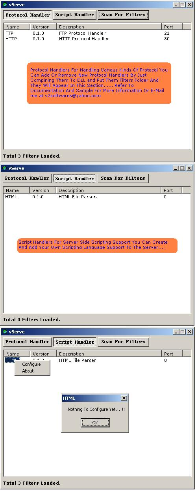



## vServe

### Description

vServe v0.1

We Serve All

What Is vServe

vServe is a plugin based Open Source Server Written Entirely In Microsoft® Visual Basic® 6.0, as this application use plugins for all the work it does, so it can virtually serve any service if there is a plugin available for that. At this time vServe supports only two kinds of plugins:

1)	PROTOCOL HANDLER

2)	SCRIPT HANDLER

PROTOCOL HANDLER

Protocol handler is used to handle request coming from clients protocol handler intercept the data coming from client and act accordingly. For Example , I have given sample plugins for HTTP And FTP handler though these are very basic handlers but can be extended to get full functionality of those protocols.

SCRIPT HANDLER

Script handler is used to intercept data and perform server side scripting before sending data to client. You can create your own scripting language or can create handlers to support already available scripting languages like ASP or PHP for web.

How It Works

vServe when started scans for all the plugins or filters in the FILTERS directory it is smart enough to distinguished between protocol handler and script handler and load them appropriately. Once the plugins are loaded into memory your server is ready to go.

Architecture Of Plugins

Every plugin is a ActiveX DLL File which has four Procedures:

1)	GetInfo

2)	Parser

3)	Configure

4)	About

1)	GetInfo

GetInfo function is used to get the information of plugin to determine what kind of plugin is it GetInfo Function is of string type and return following values

Name		=	Plugin Name

Description	=	Plugin Description

Version		=	Plugin Version

Type		=	Plugin Type (Protocol Or Script)

Port		=	Port To Listen ( Required If Type Is Protocol )

2)	Parser

Parser function is used to parse the data and is main function without which plugin is incomplete. Parser function is defined as

Public Function Parser(ByVal strInput As String, Optional ByVal LongReserved As Long, Optional ByVal StrReserved As String) As String

strInput is the data being sent by vServe To Plugin LongReserved And StrReserved are reserved for future use so can be ignored.

This function return the data back to the Server ie. vServe which is then send to client.

Note: If the plugin type is protocol then the data being sent back to vServe by plugin is once again sent to all the filters loaded to support server side scripting.

3)	Configure

This function can be used to configure the plugin for various reasons and return BOOLEAN a TRUE value indicates that plugin configuration has been updated so that vServe can update itself accordingly.

4)	About

This function is used to display plugin information.

Assumptions

Every plugin in the FILTERS folder should follow naming convention

<PROJECTNAME>.[ANYTHING]

Eg: HTTP.DLL or HTTP.plg or HTTP.ANYTHING

The Future

I have initiated this project as I always interested in Plugin based architecture and this Is my one of favorite area of Development after Client / Server based applications and as this application has both my interests so all I can say is that this is just a beginning and I need support of all you lovely and intelligent people to work with me to take this journey to its destination.

Contact Info

Email: 		v2Softwares@yahoo.com

Y! Chat: 	v2Softwares
 
### More Info
 

             |
---                |---
**Submitted On**   |2005-01-12 17:51:44
**By**             |[V2](https://github.com/Planet-Source-Code/PSCIndex/blob/master/ByAuthor/v2.md)
**Level**          |Intermediate
**User Rating**    |5.0 (30 globes from 6 users)
**Compatibility**  |VB 6\.0
**Category**       |[Internet/ HTML](https://github.com/Planet-Source-Code/PSCIndex/blob/master/ByCategory/internet-html__1-34.md)
**World**          |[Visual Basic](https://github.com/Planet-Source-Code/PSCIndex/blob/master/ByWorld/visual-basic.md)
**Archive File**   |[vServe1840721172005\.zip](https://github.com/Planet-Source-Code/v2-vserve__1-58327/archive/master.zip)

